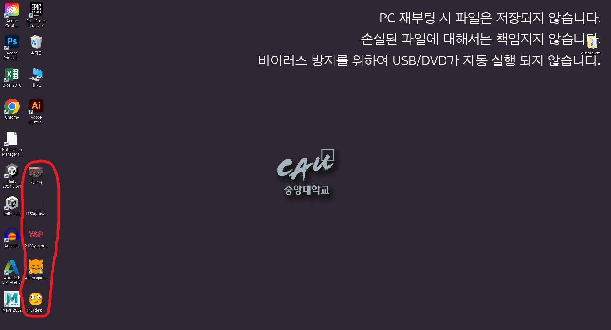

# 디스코드 이모티콘 다운
## 프로그램 실행
>프로그램을 실행했을 때의 모습을 간단하게 보여줍니다.

>어떤 프로그램인지를 명시적으로 보여줍니다.
---


프로그램을 실행한 장면입니다.



프로그램 실행을 한 후 다운로드가 완료된 이모티콘들이 배경에 다운로드 된 장면입니다.

...

## 제작의도
>왜 이 프로젝트를 진행하였는지, 그리고 어떤 프로그램이 목표인지를 설명합니다.

>이모티콘의 저작권 침해에 대해 안내합니다.
----


* 디스코드 서버 이모지란 해당 서버에서만 사용할 수 있도록 임의로 넣고, 삭제할 수 있는 특별한 이모지를 말합니다.
서버 관리자만 접근할 수 있는 서버 설정에 들어가면, 이모지 섹션에서 이렇게 서버 이모티콘을 업로드하고 관리할 수 있습니다.

* 저희의 목표는 완성된 코드들을 사람들이 더 쉽게 접하고, 사용자들이 기능을 더 편리하게 사용할 수 있도록 하는 것입니다.
  때문에 편의성을 높일 수 있는, 동작이 가능한 프로그램을 활용하여 UI, 저장 경로 메모 등을 추가하였습니다.

* 이모티콘과 같은 저작물은 반드시 제작자의 허락을 맡고 정해진 범위 내에서 사용해야 합니다. 특정 저작물들은 저장이 허락되지 않은 경우가 있으니, 주의해서 다운로드 해주세요.

## 사용방법
>프로그램 설치방법을 안내합니다.

>실행 방법을 간단히 설명합니다.
---
1. GitHub에서 'otherd15.py' 파일을 다운로드합니다.

2. ’pip install discord’를 실행합니다.
   이 코드는 디스코드 기반으로 작동하기 때문에, 해당 라이브러리 없이는 코드가 정상적으로 작동하지 않습니다.

3. ‘pip install requests’를 실행합니다.
   requests 라이브러리는 http URL을 다루기 위해 사용됩니다. 이 라이브러리 없이는 인터넷에 연결할 수 없어 프로그램이 실행되지 않습니다

4. ‘pip install PyQt5’를 실행합니다.
   PyQt5는 Qt Designer에서 생성된 UI를 구현하고 실행하기 위한 라이브러리입니다. 이것 없이는 UI를 실행할 수 없으며, 따라서 코드 역시 실행할 수 없습니다.

5. 그 밖에 sys, os, asyncio, shutil등의 라이브러리가 설치되지 않았다면 다운로드 해야 합니다. 위에서 강조한 라이브러리들은 대부분의 컴퓨터에 기본적으로 설치되어 있지 않습니다.

6. 코드를 실행시키기 위해서는 Python IDLE이 필요합니다. 이를 통해 'otherd15.py' 파일을 쉽게 실행할 수 있습니다. (파일을 더블클릭하면 바로 실행됩니다.)

   하지만 필요한 라이브러리들을 설치하려면, 'pip install' 명령을 사용해야 합니다. 이를 위해 CMD(명령 프롬프트)나 Git Bash와 같은 터미널을 열고 필요한 라이브러리들을 다운로드하면 됩니다.


필요한 과정들을 완료했다면 프로그램은 사용자에게 하나의 입력창을 표시합니다


봇 토큰과 서버 아이디를 입력하고, 저장 경로를 선택하면 사용자가 원하는 위치에 이모티콘을 다운로드할 수 있습니다.

* 봇 토큰?
  
  디스코드의 봇 == 특정 서버에서 다양한 설정을 관리하는 프로그램
  디스코드 개발자 서버에 접속하여 OAuth2 섹션으로 이동, URL Generator의 Scope목록에서 ‘bot‘을 선택한 후, Generated URL에서 Copy버튼을 누르면 봇이 생성됩니다.
  이 URL을 실행하면 다른 서버에 봇을 추가할 수 있으며, 전제조건으로 봇을 추가하려는 해당 서버의 관리자여야 합니다.
  봇에는 고유한 토큰이 있으며, 생성된 봇 페이지에서 'BOT' 섹션으로 들어가 토큰을 생성할 수 있습니다.
  
* 서버 ID?
  
  계정 설정에서 '고급'을 선택하고 '개발자 모드'를 활성화하여 서버 ID를 찾을 수 있었습니다.

## 수정내용
>어떤 오픈소스를 사용하였는지 설명합니다.

>어떤 부분이 수정되었는지 설명합니다.
---
[원본코드 - DiscordEmojiDownloader](https://github.com/Bartuzen/DiscordEmojiDownloader.git)

* 이 코드의 주요 장점은, 이 코드를 공유할 경우 봇의 정보와 서버 ID만 있다면 서버 내에 있는 이모티콘을 다른 사람도 다운로드 할 수 있다는 점입니다. 하지만 봇의 토큰과 서버 ID를 공개하는 경우 개인정보가 위험할 수 있습니다. 따라서 사용자는 신중하게 사용해야 합니다.

* 코드
  
  `[average_main.py]`
  
  트윗 임베딩 :
  
   best_model 디렉토리에 저장된 모델을 사용하여 트윗을 임베딩하는 encode_char.py라는 스크립트를 호출.
   임베딩 결과를 (.npy 형식으로) CSV 파일로 변환.
  교차 검증용 데이터 분할 :
  
  k-폴드 교차 검증(k=5)을 사용하여 데이터를 교육 및 테스트 세트로 분할,
  분할된 데이터를 별도의 CSV 파일에 저장.
  이모지 임베딩 :
   EmojiEmbeddings.py라는 스크립트를 사용해 이모지를 임베딩.
  이모지 추천 :
   EmojiRecommender.py라는 스크립트를 사용하여 코사인 유사성, 랭킹 및 정확도 계산을 통해 이모지를 추천.
```
이전코드
->
변경 후 코드
```
