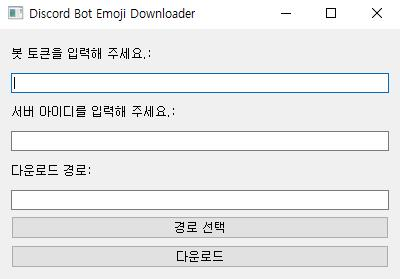
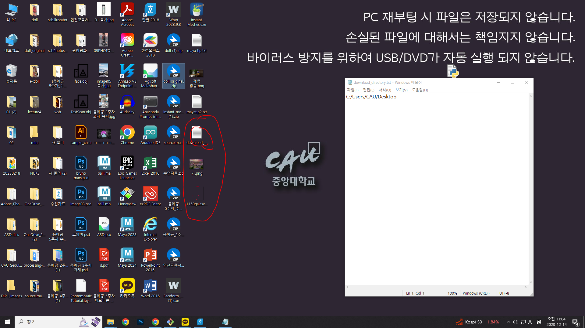
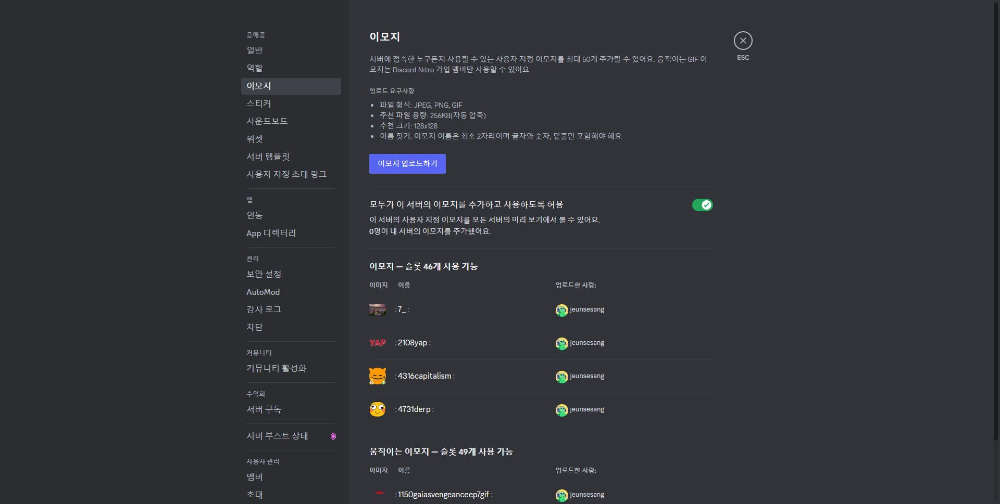

# 디스코드 서버 이모티콘 다운
## 프로그램 실행
>프로그램을 실행했을 때의 모습을 간단하게 보여줍니다.

>어떤 프로그램인지를 명시적으로 보여줍니다.
---


프로그램을 실행한 장면입니다.



프로그램 실행을 한 후 다운로드가 완료된 이모티콘들이 배경에 다운로드 된 장면입니다.

그리고 다운이 끝나면 open함수를 이용하여 파일의 경로가 텍스트 파일로 데스크톱에 저장되어있는 것을 보실 수 있습니다.

## 제작의도
>왜 이 프로젝트를 진행하였는지, 그리고 어떤 프로그램이 목표인지를 설명합니다.

>이모티콘의 저작권 침해에 대해 안내합니다.
----


* 디스코드 서버 이모지란 해당 서버에서만 사용할 수 있도록 임의로 넣고, 삭제할 수 있는 특별한 이모지를 말합니다.
서버 관리자만 접근할 수 있는 서버 설정에 들어가면, 이모지 섹션에서 이렇게 서버 이모티콘을 업로드하고 관리할 수 있습니다.

* 저희의 목표는 완성된 코드들을 사람들이 더 쉽게 접하고, 사용자들이 기능을 더 편리하게 사용할 수 있도록 하는 것입니다.
  때문에 편의성을 높일 수 있는, 동작이 가능한 프로그램을 활용하여 UI, 저장 경로 메모 등을 추가하였습니다.

* 이모티콘과 같은 저작물은 반드시 제작자의 허락을 맡고 정해진 범위 내에서 사용해야 합니다. 특정 저작물들은 저장이 허락되지 않은 경우가 있으니, 주의해서 다운로드 해주세요.

## 사용방법
>프로그램 설치방법을 안내합니다.

>실행 방법을 간단히 설명합니다.
---
1. GitHub에서 'otherd15.py' 파일을 다운로드합니다.

2. ’pip install discord’를 실행합니다.
   이 코드는 디스코드 기반으로 작동하기 때문에, 해당 라이브러리 없이는 코드가 정상적으로 작동하지 않습니다.

3. ‘pip install requests’를 실행합니다.
   requests 라이브러리는 http URL을 다루기 위해 사용됩니다. 이 라이브러리 없이는 인터넷에 연결할 수 없어 프로그램이 실행되지 않습니다

4. ‘pip install PyQt5’를 실행합니다.
   PyQt5는 Qt Designer에서 생성된 UI를 구현하고 실행하기 위한 라이브러리입니다. 이것 없이는 UI를 실행할 수 없으며, 따라서 코드 역시 실행할 수 없습니다.

5. 그 밖에 sys, os, asyncio, shutil등의 라이브러리가 설치되지 않았다면 다운로드 해야 합니다. 위에서 강조한 라이브러리들은 대부분의 컴퓨터에 기본적으로 설치되어 있지 않습니다.

6. 코드를 실행시키기 위해서는 Python IDLE이 필요합니다. 이를 통해 'otherd15.py' 파일을 쉽게 실행할 수 있습니다. (파일을 더블클릭하면 바로 실행됩니다.)

   하지만 필요한 라이브러리들을 설치하려면, 'pip install' 명령을 사용해야 합니다. 이를 위해 CMD(명령 프롬프트)나 Git Bash와 같은 터미널을 열고 필요한 라이브러리들을 다운로드하면 됩니다.


필요한 과정들을 완료했다면 프로그램은 사용자에게 하나의 입력창을 표시합니다


봇 토큰과 서버 아이디를 입력하고, 저장 경로를 선택하면 사용자가 원하는 위치에 이모티콘을 다운로드할 수 있습니다.

* 봇 토큰?
  
  디스코드의 봇 == 특정 서버에서 다양한 설정을 관리하는 프로그램
  디스코드 개발자 서버에 접속하여 OAuth2 섹션으로 이동, URL Generator의 Scope목록에서 ‘bot‘을 선택한 후, Generated URL에서 Copy버튼을 누르면 봇이 생성됩니다.
  이 URL을 실행하면 다른 서버에 봇을 추가할 수 있으며, 전제조건으로 봇을 추가하려는 해당 서버의 관리자여야 합니다.
  봇에는 고유한 토큰이 있으며, 생성된 봇 페이지에서 'BOT' 섹션으로 들어가 토큰을 생성할 수 있습니다.
  
* 서버 ID?
  
  계정 설정에서 '고급'을 선택하고 '개발자 모드'를 활성화하여 서버 ID를 찾을 수 있었습니다.

## 수정내용
>어떤 오픈소스를 사용하였는지 설명합니다.

>어떤 부분이 수정되었는지 설명합니다.
---
[원본코드 - DiscordEmojiDownloader](https://github.com/Bartuzen/DiscordEmojiDownloader.git)

* 디스코드 서버에서 사용할 수 있는 이모티콘들을 다운로드하는 프로그램입니다.
  
* 수정한 코드의 주요 장점은, 이 코드를 공유할 경우 봇의 정보와 서버 ID만 있다면 서버 내에 있는 이모티콘을 다른 사람도 다운로드 할 수 있다는 점입니다.
* 하지만 봇의 토큰과 서버 ID를 공개하는 경우 개인정보가 위험할 수 있습니다. 따라서 사용자는 신중하게 사용해야 합니다.

* 코드설명

DiscordBotWorker 클래스 : 사용자의 입력에 따라 Discord 봇을 실행하고, 해당 서버의이모지를 다운로드하는 클래스입니다.

__init__ 함수 : 프로그램이 실행된 후 모든 값 즉, 봇의 토큰 칸, 서버 아이디,
파일 디렉토리등을 전부 초기화해서 새로 입력 할 수 있도록 하는 생성자 함수입니다.

run 함수 : 사용자가 원할 때 프로그램을 실행시킬 수 있는 루프를 생성하고, 디스코드 봇을 시작하는 ‘download_emojis‘ 함수를 실행합니다.

download_emojis 함수 : 디스코드의 봇을 생성하고, 봇이 서버에 연결되면 이를 이용해
서버의 이모지를 다운로드하는 함수입니다.

on_ready 함수 : 대부분 github의 코드를 참고한 코드입니다. start가 프린트되면
다운로드가 시작되고, 다운로드 중 서버 내에 있는 이모티콘들을 찾아내는 함수입니다.

download_image 함수 : 사용자로부터 주어진 URL에서 이미지를 다운로드하고, 지정된
저장 경로에 저장하는 함수입니다. 시작시 오류 확인을 위해 프린트 함수를 사용했습니다.

DiscordBotDownloader 클래스 : 파이썬 모듈 모음인 PyQt5를 사용하여 GUI를 구현한
클래스입니다.

__init__ 함수 : 앞서 이야기 했던 같은 함수와 같이 생성자 역할을 합니다.

init_ui 함수 : GUI의 초기 설정을 수행합니다. 토큰, 서버 아이디, 다운로드 경로를
입력받을 수 있는 텍스트 입력란과 시작 버튼을 생성하고 배치합니다.

choose_directory 함수 : "경로 선택" 버튼이 눌리면 다운로드 경로를 선택하는 대화상자가 열리도록 하는 함수입니다.

start_download 함수 : "다운로드" 버튼이 클릭되면 입력된 토큰, 서버 아이디, 다운로드 경로를 가져와 DiscordBotWorker 클래스를 활성화하고 해당 클래스의 run 함수를 실행합니다. 토큰, 서버 아이디나 다운로드 경로가 잘못되었다면 오류 메시지를 출력해주는 기능을 추가했습니다.

download_finished 함수 : DiscordBotWorker에서 이모지 다운로드가 완료되면 호출되어 성공 메시지를 표시합니다.

show_message 함수 : PyQt의 QMessageBox를 이용하여 모든 메시지 박스를 생성하고
실행합니다.

__코드 수정__
```
def download_image(url, name):
    headers = {'User-Agent': 'Mozilla/5.0 (Windows NT 6.1; WOW64) AppleWebKit/537.36 (KHTML, like Gecko) Chrome/34.0.1847.137 Safari/537.36'}
    extension = url[-3:]
    response = requests.get(url, stream=True, headers=headers)
    with open(f"images\\{name}.{extension}", 'wb') as out_file:
        shutil.copyfileobj(response.raw, out_file)
>>
async def download_image(self, url, name):
        try:
            headers = {'User-Agent': 'Mozilla/5.0 (Windows NT 6.1; WOW64) AppleWebKit/537.36 (KHTML, like Gecko) Chrome/34.0.1847.137 Safari/537.36'}
            response = requests.get(url, stream=True, headers=headers)
            response.raise_for_status()  # Check for HTTP errors
            extension = url[-3:]
            with open(os.path.join(self.download_directory, f"{name}.{extension}"), 'wb') as out_file:
                shutil.copyfileobj(response.raw, out_file)
            print(f"Downloaded: {name}")
        except requests.exceptions.HTTPError as errh:
            print(f"HTTP Error: {errh}")
        except requests.exceptions.ConnectionError as errc:
            print(f"Error Connecting: {errc}")
        except requests.exceptions.Timeout as errt:
            print(f"Timeout Error: {errt}")
        except requests.exceptions.RequestException as err:
            print(f"Request Exception: {err}")
```
```
class Bot(discord.Client):
    async def on_ready(self):
        print("Started")
        guild = self.get_guild(guild_id)
        emojis = guild.emojis
        for each in emojis:
            if each.animated:
                download_image(f"https://cdn.discordapp.com/emojis/{each.id}.gif", each.name)
            else:
                download_image(f"https://cdn.discordapp.com/emojis/{each.id}.png", each.name)
        print("Finished")
>>
async def on_ready():
                    print("Started")
                    for guild in bot.guilds:
                        if guild.id == self.guild_id:
                            emojis = guild.emojis
                            for each in emojis:
                                if each.animated:
                                    await self.download_image(f"https://cdn.discordapp.com/emojis/{each.id}.gif", each.name)
                                else:
                                    await self.download_image(f"https://cdn.discordapp.com/emojis/{each.id}.png", each.name)
                            print("Finished")
                            self.finished.emit()
                            await bot.close()
```
